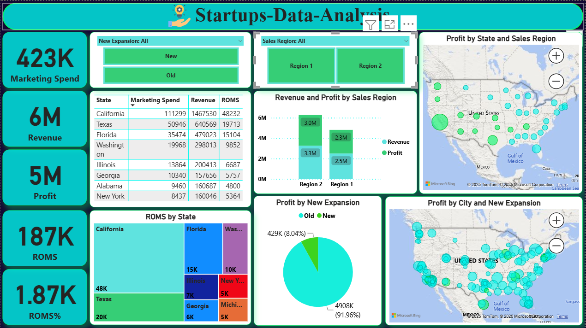
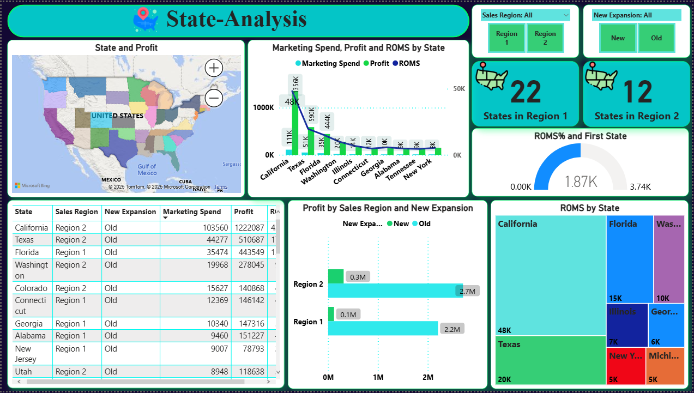
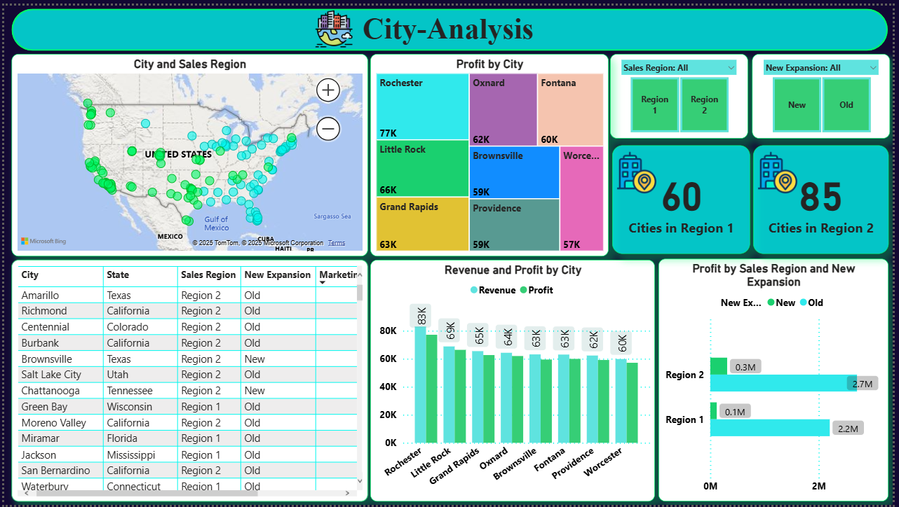

# 🚀 Startups Data Analysis | تحليل بيانات الشركات الناشئة  

  

---

## 📌 Overview | نظرة عامة  
This project analyzes startup expansion, marketing spend, revenue, and profit across U.S. states and cities.  
المشروع بيحلل بيانات الشركات الناشئة من حيث **التوسع الجديد**، **مصاريف التسويق**، **الإيرادات**، و **الأرباح** عبر الولايات والمدن.  

---

## 🛠️ Tools & Libraries | الأدوات والمكتبات  
- 🐍 Python (Pandas, Numpy, Matplotlib, Seaborn)  
- 📊 Power BI  
- 💻 GitHub for version control  

---

## 📷 Dashboards | لوحات التحكم  

### 🏠 Home Dashboard  
  

**Insights | الإنسايت:**  
- EN: California & Texas have the highest marketing spend and revenue.  
- AR: ولاية كاليفورنيا وتكساس هما الأعلى في مصاريف التسويق والإيرادات.  

- EN: Region 2 generates more revenue but Region 1 has higher efficiency (ROMS%).  
- AR: الإقليم 2 بيحقق إيرادات أعلى، لكن الإقليم 1 أكثر كفاءة (ROMS%).  

- EN: New expansions are still limited compared to old branches.  
- AR: التوسعات الجديدة مازالت محدودة مقارنة بالفروع القديمة.  

**Recommendations | التوصيات:**  
- EN: Focus on **expanding in Region 1** to balance growth.  
- AR: التركيز على **التوسع في الإقليم 1** لتحقيق توازن في النمو.  

- EN: Optimize marketing spend in **California** where ROI is lower than expected.  
- AR: تحسين مصاريف التسويق في **كاليفورنيا** حيث العائد أقل من المتوقع.  

- EN: Increase **investment in new expansions** for long-term growth.  
- AR: زيادة **الاستثمار في التوسعات الجديدة** لتحقيق نمو طويل المدى.  

---

### 🗺️ State Analysis  
  

**Insights | الإنسايت:**  
- EN: California, Texas, and Florida dominate profit contributions.  
- AR: كاليفورنيا، تكساس، وفلوريدا مسيطرين على المساهمة في الأرباح.  

- EN: Region 2 contributes more overall profit compared to Region 1.  
- AR: الإقليم 2 يحقق أرباح إجمالية أعلى مقارنة بالإقليم 1.  

- EN: Some states (e.g., Alabama, Georgia) show potential with low marketing spend but good returns.  
- AR: بعض الولايات (زي ألاباما وجورجيا) عندها فرص رغم انخفاض الإنفاق التسويقي لكن بتحقق عائد جيد.  

**Recommendations | التوصيات:**  
- EN: Maintain investment in **California & Texas**.  
- AR: الاستمرار في الاستثمار في **كاليفورنيا وتكساس**.  

- EN: Explore **untapped states in Region 1** for potential expansion.  
- AR: استكشاف **الولايات غير المستغلة في الإقليم 1** لفرص التوسع.  

- EN: Increase marketing efficiency in states with high spend but low profit.  
- AR: رفع كفاءة التسويق في الولايات اللي فيها إنفاق عالي لكن أرباح قليلة.  

---

### 🌆 City Analysis  
  

**Insights | الإنسايت:**  
- EN: Cities like Rochester, Oxnard, and Little Rock show strong profitability.  
- AR: مدن زي روتشستر، أوكسنارد، وليتل روك بتظهر ربحية قوية.  

- EN: Region 2 has more cities with high performance compared to Region 1.  
- AR: الإقليم 2 فيه عدد أكبر من المدن عالية الأداء مقارنة بالإقليم 1.  

- EN: New expansions are limited in some profitable cities.  
- AR: التوسعات الجديدة قليلة في بعض المدن المربحة.  

**Recommendations | التوصيات:**  
- EN: Expand further in **top-performing cities** (Rochester, Little Rock).  
- AR: التوسع بشكل أكبر في **المدن الأعلى أداءً** (روتشستر، ليتل روك).  

- EN: Encourage **new expansions** in underutilized but profitable areas.  
- AR: تشجيع **التوسعات الجديدة** في المناطق المربحة غير المستغلة.  

- EN: Focus on improving **marketing strategies at the city level**.  
- AR: التركيز على تحسين **استراتيجيات التسويق على مستوى المدن**.  

---

## 📈 Key Metrics | أهم المؤشرات  
- 💰 Revenue (الإيرادات)  
- 📊 Profit (الأرباح)  
- 🎯 ROMS% (Return on Marketing Spend)  العائد على الإنفاق التسويقي
- 🏙️ City & State expansion (توسع المدن والولايات)  

---

## 📂 Repository Structure | هيكل المشروع  
Startups-Data-Analysis/
├── 📁 data/               # البيانات الخام والمعالجة
├── 📁 notebooks/          # تحليلات Python (Jupyter Notebooks)
├── 📁 Screenshot/         # صور لوحات التحكم
├── 📄 requirements.txt    # متطلبات التشغيل (المكتبات)
└── 📄 README.md           # وثيقة المشروع

---
✨ تم تطوير هذا المشروع بهدف تحويل البيانات إلى رؤى قابلة للتطبيق تدعم اتخاذ القرارات الاستراتيجية.
✨ This project was developed to transform raw data into actionable insights that support strategic decision-making.
---

## 📫 Let’s Connect | تواصل معي  

  
  
  

---
